<p align="center">
  <picture>
    <source media="(prefers-color-scheme: dark)" srcset="public/brand/bloks-wordmark-dark.png">
    <source media="(prefers-color-scheme: light)" srcset="public/brand/bloks-wordmark-light.png">
    
  </picture>
</p>

<p align="center">
  A local-first desktop workspace for personal AI agents.<br>
  Your agents, your machine, your data.
</p>

<p align="center">
  <a href="LICENSE"></a>
  <a href="https://github.com/hamedgitty/bloks/actions/workflows/ci.yml"></a>
  
  <a href="https://apps.apple.com/app/bloks-ai-agents/id6804453451"></a>
  
</p>

<p align="center">
  <picture>
    <source media="(prefers-color-scheme: dark)" srcset="docs/screenshots/hero-dark.png">
    <source media="(prefers-color-scheme: light)" srcset="docs/screenshots/hero.png">
    
  </picture>
</p>

---

Bloks looks like a messaging app. Each agent is a contact you talk to,
each room is a group chat, and the whole thing runs on your machine. No
account, no backend, no sync.

Underneath, every agent is a real provider session. Agents stream their
replies, show you the tools they are running, and stop to ask before
doing anything that needs your say-so.

## What makes it different

**Agents work together, with a chain of command.** Put several in a room
and they take turns rather than talking over each other. The most senior
one speaks last, reviews what came back, and makes the call when members
disagree. An agent's memory follows it between rooms and DMs, so you can
ask your Chief of Staff privately what it thought of the group's plan.

**Cheap hands, expensive judgement.** A lead that needs more people can
propose a team: who it wants, what each one owns, which skills to give
them. You approve or you don't. Hires run on the cheapest model the
provider offers and do the volume; the lead keeps its costlier model for
review. That is the whole economics of it, and it is the same reason a
company has juniors.

**Any engine.** Claude Code, Codex, Gemini CLI and Pi run as real agents that
use tools and touch files. Gemini, Grok, Kimi, Llama, DeepSeek, Mistral,
Groq, OpenRouter and Ollama connect as chat engines. A custom
OpenAI-compatible host takes a base URL and one or more keys. OpenRouter has a
proper browser sign-in; the rest take a key or ride along with a CLI you
already signed in to.

**Skills are files you can read.** A skill is markdown that gets folded
into an agent's prompt. Bloks ships a starter library and shows you the
full body of anything before it is installed, because a skill is closer
to a script than to a note. After a conversation that worked something
out, Bloks can read it back and offer the procedure as a skill. Nothing
is ever installed on its own. Type `/` in a message to pick one of the
agent's skills by name, including the ones installed for Claude Code.

**Rules you write in a sentence.** "Refuse when the command contains
`rm -rf`." Rules are decided before an agent acts, not after, and only
what they do not cover reaches you. A deny always beats an allow.

**Take the wheel.** Driving something yourself for a minute stops the
agent: no turns start, routines skip, the job board looks elsewhere, and
anything it was mid-way through is interrupted. Refused rather than
queued, because a queue would replay a plan made before you changed
things underneath it.

**Undo what an agent did.** Before every turn, Bloks photographs the
folder the agent works in, and after it, again. What changed shows up
under the reply as a card: each file, how many lines, and its diff. One
button puts the folder back as it was. Anything you or a later turn
changed since is left alone and named, never overwritten.

<p align="center">
  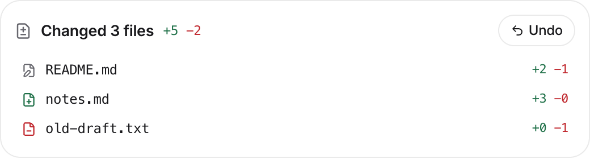
</p>

**Work with more than one step.** A workflow is a trigger, some steps,
and somewhere a person says yes. Runs are state on disk rather than a
promise nobody can restart, so quitting the app does not lose one.

**Answers that are not paragraphs.** An agent can reply with a chart, a
table, a recommendation, a sequence, a quotation or a refusal. Every one
is validated before it reaches a screen, because what arrives is JSON a
model wrote.

**A record you can check.** Consequential actions land in an append-only
log, each entry hash-chained to the one before it and signed by the agent
it is about. There is a button that walks the chain and reports
tampering.

**Your phone can answer, and so can any browser.** The [iPhone app](https://apps.apple.com/app/bloks-ai-agents/id6804453451) reaches your own
Mac over a sealed relay: approvals, workflow gates, and a screen showing
what every agent is doing right now and what the day has cost. Pair it by
reading a six digit code off your Mac. Approval banners carry the real
request, decrypted on the phone, with Allow and Deny behind Face ID;
anything in the share sheet can be sent to an agent; and Siri, Shortcuts
or the Action Button can ask one without opening the app. With Bloks Cloud, the same app you
use on your Mac also opens at [bloks.dev/web](https://bloks.dev/web) on
any computer: Settings, Devices, **Use in a browser** makes a one-time
link. Every request is sealed in the browser for your Mac alone, so the
site that serves the page never sees what it carries.

**Share a room with people.** Invite a partner or a client into a room.
They join from the iPhone app or a browser, talk to your agents with
you, and never touch your computer: you choose which of your tools the
room may use, who may approve what an agent asks, and a monthly spending
cap. Rooms can also be carried into a Slack or Discord channel, or a
WhatsApp group, where agents answer only when they are mentioned and
strangers knock before anyone listens.

**Memory you can read, and take back.** What each agent remembers is
plain Markdown in its own folder. The Memory panel shows every agent's
files for editing, and a journal of every change, whether the agent
made it or you did, each with its diff and an undo.

**Teams as files.** A team is one Markdown file: a heading per member,
their seniority and skills, and a brief. Export any room as one, import
one from a friend, or hire from the gallery at
[bloks.dev/teams](https://bloks.dev/teams/).

**Always on.** Agents run where Bloks runs, and a laptop sleeps. Bloks
keeps the Mac awake while an agent is mid-turn and picks a turn back up
after a sleep. For agents that never stop, `bloks-server` runs the whole
workspace on a machine that stays on (a Mac mini, a Linux box, a VPS),
and the desktop app, the phone and the browser all reach it the same way.

## Install

Download it from [bloks.dev](https://bloks.dev), or from the
[Releases](https://github.com/hamedgitty/bloks/releases) page. The iPhone
app is [on the App Store](https://apps.apple.com/app/bloks-ai-agents/id6804453451). macOS
builds are signed and notarized, so they open without a Gatekeeper
warning. Windows and Linux builds are unsigned, which on Windows means
SmartScreen warns on first run.

Or run it from source:

```sh
git clone https://github.com/hamedgitty/bloks.git
cd bloks
pnpm install

pnpm dev:server   # the harness, on 127.0.0.1:8799
pnpm dev          # the app, on 127.0.0.1:5199
```

Open `http://127.0.0.1:5199`. For the desktop shell, run `pnpm
dev:desktop` in a third terminal.

**Requirements:** Node 22+, pnpm, and at least one engine. macOS for the
desktop shell and computer use; the browser app runs anywhere Node does.

## Getting an engine

You need one of these before an agent can reply. Any of them works.

| Engine | How you connect | Runs tools |
| --- | --- | --- |
| Claude Code | `npm i -g @anthropic-ai/claude-code`, then `claude` | yes |
| Codex | `npm i -g @openai/codex`, then `codex login` | yes |
| Gemini CLI | `npm i -g @google/gemini-cli`, then a Google sign-in or a Gemini key | yes |
| Pi | `npm i -g --ignore-scripts @earendil-works/pi-coding-agent && npm i -g pi-acp`, then `pi` (or `pi-acp --terminal-login`) | yes |
| OpenRouter | Sign in from Settings, in your browser | no |
| Gemini, Grok, Kimi, Llama, DeepSeek, Mistral, Groq | Paste a key in Settings | no |
| Custom (OpenAI-compatible) | Paste a base URL and key(s) in Settings | no |
| Ollama | Run it; Bloks finds it on this machine | no |

The engines marked "runs tools" can execute commands and read files. The
rest only produce text, which matters more than it sounds: an agent moved
onto a chat engine quietly loses half its job. Bloks badges the
difference everywhere it shows an engine.

One OpenRouter sign-in reaches most of the labs above through a single
account, which is the shortest path from a clean install to a working
agent.

<p align="center">
  
</p>

## Pair your iPhone

The [iPhone app](https://apps.apple.com/app/bloks-ai-agents/id6804453451) is a window onto Bloks running on your computer:
the same agents, their chats, and approval cards you answer with a tap.
Nothing runs on the phone, so it is paired with the computer once. It
takes about a minute, with both on the same wifi. It works the same from a
Mac, a Windows PC or Linux; the iPhone app calls it "your Mac" either way.

### On your computer

**1. Open Settings at the bottom of the sidebar and choose Devices.**

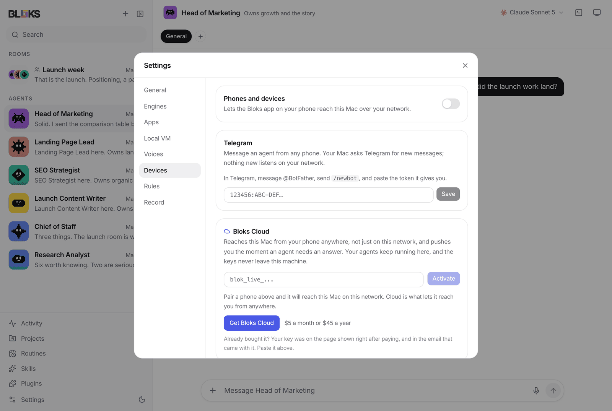

**2. Switch on Phones and devices, then press Restart now.** Bloks only
starts listening on your network when it starts, so this is needed once. If
your computer asks whether Bloks may accept incoming connections, allow it.

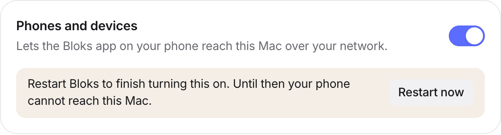

**3. When Bloks is back, press Pair a phone.**

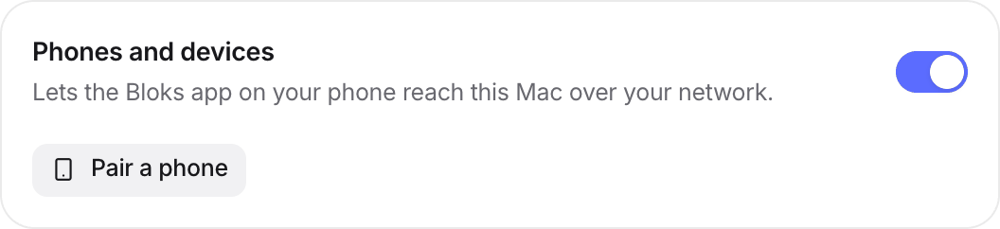

**4. Bloks shows a QR code, a six digit code, and the address for the phone.**
The code lasts five minutes and works once. If it runs out, press Pair a
phone again.

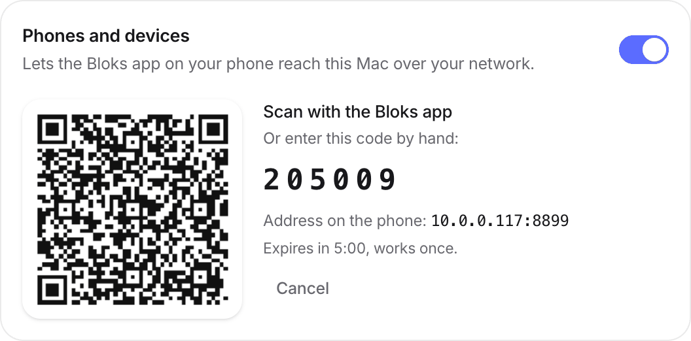

### On your iPhone

**5. Install [Bloks from the App Store](https://apps.apple.com/app/bloks-ai-agents/id6804453451) and open it.** Until it is
paired it says so.

**6. The quick way:** point the Camera at the QR code on your computer and tap
the Bloks banner. Bloks opens and asks to pair; tap **Pair this device**.

**7. Or by hand:** tap the round button at the top right, then **Settings**,
then **Mac connection**. Enter the address and port your computer shows, type
the six digit code, and tap **Pair this device**. The **Scan the QR on your
Mac** row there scans from inside the app if the Camera route did not work.

<table>
  <tr>
    <td align="center">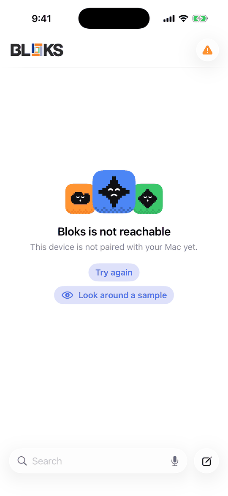<br><sub>5. Not paired yet</sub></td>
    <td align="center">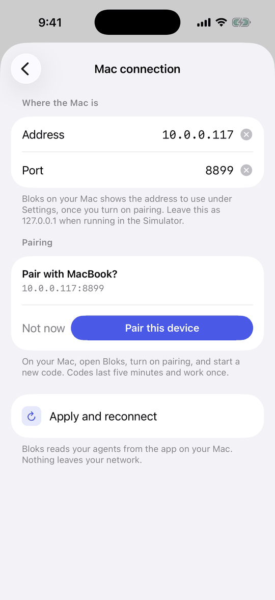<br><sub>6. After scanning the QR</sub></td>
    <td align="center">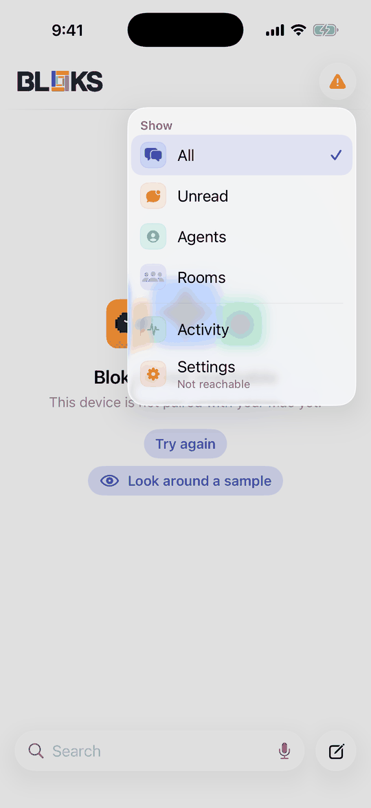<br><sub>7. The menu, top right</sub></td>
  </tr>
  <tr>
    <td align="center">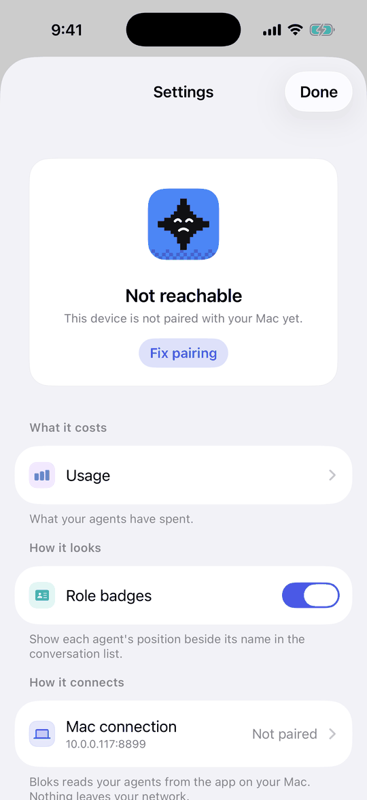<br><sub>7. Settings, Mac connection</sub></td>
    <td align="center">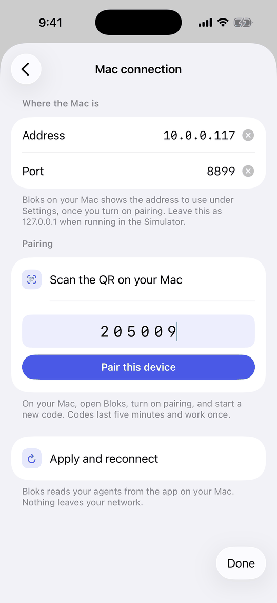<br><sub>7. Address, port and code</sub></td>
    <td align="center">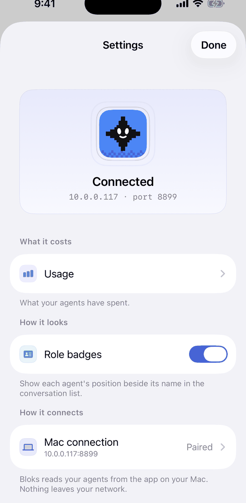<br><sub>8. Connected</sub></td>
  </tr>
</table>

**8. That is it.** Settings says Connected, your agents are on the phone, and
the computer lists the phone under Paired, where the bin icon unpairs it.

<p>
  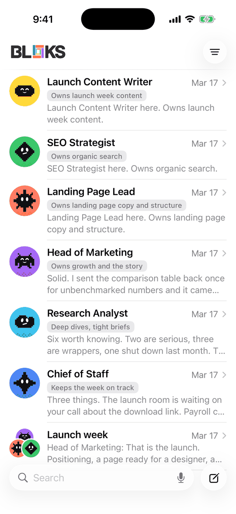
  &nbsp;
  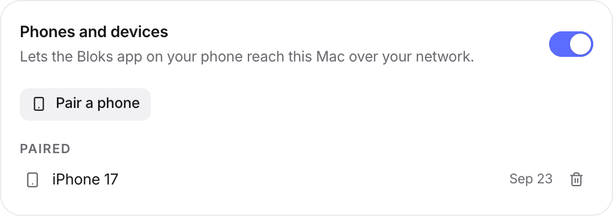
</p>

### If it does not connect

- **"Not paired with your Mac yet":** there is no pairing, or it was undone on
  the computer. Start a new code.
- **The code was refused:** codes last five minutes, work once, and a few wrong
  guesses close the window. Press Pair a phone for a new one.
- **The phone cannot reach the computer:** both need the same wifi, not a guest
  network, and no VPN on either side. Check you pressed Restart now.
- **Firewall:** if you declined the incoming connections prompt, allow Bloks in
  your firewall settings (on a Mac, System Settings, Network, Firewall).
- **It worked yesterday:** the computer's address can change when it rejoins
  the network. Enter the new one under Mac connection and tap Apply and
  reconnect.

## Where your data lives

Everything is under `~/.bloks`:

| Path | Contents |
| --- | --- |
| `bots.json` | Agents, their roles, models and resume cursors |
| `bloks.json` | Rooms and their members |
| `messages-<id>.json` | One transcript per agent or room |
| `config.json` | Connected engines and keys, `0600` in a `0700` directory |
| `skills/` | Installed skills, one markdown file each |
| `checkpoints/` | Each turn's before and after, kept once per file version, for undo |
| `memory-journal/` | Every change to an agent's memory, with the text before and after |
| `events/`, `native/` | The canonical event stream, and raw provider traffic |

Bloks has no server of its own. It makes two requests on its own behalf,
neither carrying your data: a packaged build asks GitHub for the latest
release on launch, and browsing the skill catalog fetches it from
bloks.dev. Everything else on the wire is the engines and connectors you
configure, talking to their own services.

## How it is built

```
src/       React app: chat, rooms, panels, the pixel avatar system
server/    Harness: HTTP API, one SSE stream, provider registry, persistence
electron/  macOS shell: window, packaged server, speech and computer bridges
```

One rule holds the shape together: **the client holds no transports.**
The React app never talks to a provider. It sends typed commands over
HTTP and folds a single server-sent event stream. Every provider process
lives in the harness.

That is why adding an engine is usually data rather than code. An
OpenAI-compatible API is a spec in `server/providers.ts`. An agent CLI
that speaks the [Agent Client
Protocol](https://agentclientprotocol.com) is a spec in
`server/drivers/acp.ts`.

See [docs/ARCHITECTURE.md](docs/ARCHITECTURE.md) for the longer version.

## Security

Agents can read your files, use your logged-in accounts, and drive a
computer. [SECURITY.md](SECURITY.md) states the trust model plainly,
including the parts that are not solved yet. The short version:

- The harness is loopback-only and checks `Origin` and `Host`, because
  loopback alone is not a boundary in a browser.
- Approval cards block until you answer, and engines are driven over
  protocols that can carry a permission request for exactly that reason.
- Keys sit in a `0600` file, not the Keychain. That is the top open item.
- There is no analytics token in this repository.
- Released builds are signed and notarized. One you build yourself is
  not, and macOS will tell you so.

## Contributing

Read [CONTRIBUTING.md](CONTRIBUTING.md). Short form: one thing per pull
request, tell us what you verified rather than what you changed, and run
`pnpm typecheck && pnpm test && pnpm build` before you push.

Bloks is maintained by one person alongside other work. Issues and pull
requests are read, and answered when there is time. Small and focused
gets merged quickly; a branch that renames files, fixes a bug and adds a
feature may sit for a while.

```sh
pnpm test
```

Node's built-in runner, no framework to install. Around 850 tests
covering the origin check, input limits, model-output parsing, room
addressing, skill paths, workflow runs, the policy engine, the client
reducer, the colour palette's own contrast, and the real server over
HTTP. It takes about a minute and a half and needs no credentials. See
[test/README.md](test/README.md).

## Licence

[FSL-1.1-MIT](LICENSE). Free for any use except selling Bloks, or
something substantially like it, to other people. Internal use at work is
explicitly fine, at any company size, with no fee.

Every release converts to plain MIT two years after it ships, and that
conversion cannot be withdrawn.

[LICENSING.md](LICENSING.md) explains it in plain English.
