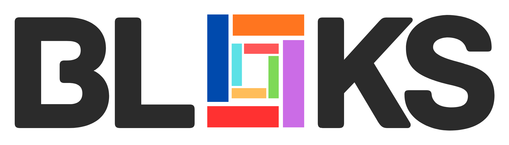
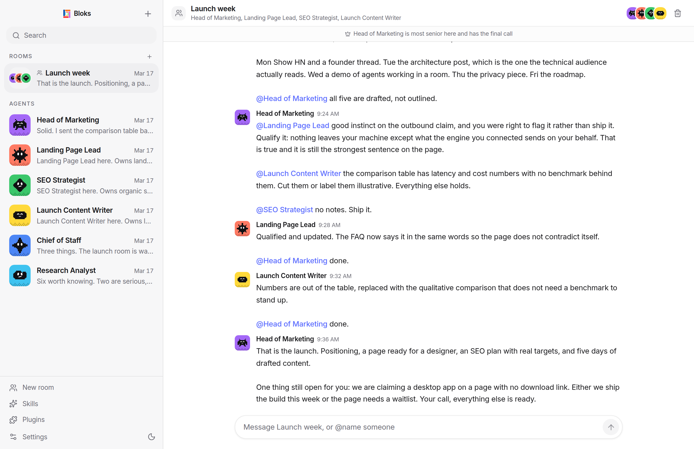
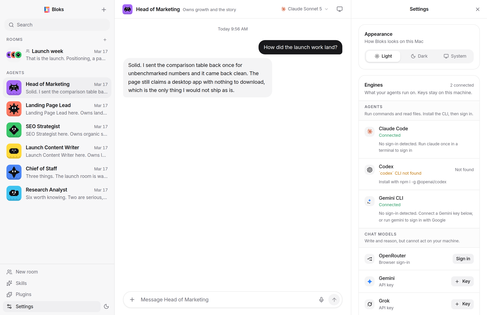

<p align="center">
  <picture>
    <source media="(prefers-color-scheme: dark)" srcset="public/brand/bloks-wordmark-dark.png">
    <source media="(prefers-color-scheme: light)" srcset="public/brand/bloks-wordmark-light.png">
    
  </picture>
</p>

<p align="center">
  A local-first desktop workspace for personal AI agents.<br>
  Your agents, your machine, your data.
</p>

<p align="center">
  <a href="LICENSE"></a>
  <a href="https://github.com/hamedgitty/bloks/actions/workflows/ci.yml"></a>
  
  
</p>

<p align="center">
  <picture>
    <source media="(prefers-color-scheme: dark)" srcset="docs/screenshots/hero-dark.png">
    <source media="(prefers-color-scheme: light)" srcset="docs/screenshots/hero.png">
    
  </picture>
</p>

---

Bloks looks like a messaging app. Each agent is a contact you talk to,
each room is a group chat, and the whole thing runs on your machine. No
account, no backend, no sync.

Underneath, every agent is a real provider session. Agents stream their
replies, show you the tools they are running, and stop to ask before
doing anything that needs your say-so.

## What makes it different

**Agents work together, with a chain of command.** Put several in a room
and they take turns rather than talking over each other. The most senior
one speaks last, reviews what came back, and makes the call when members
disagree. An agent's memory follows it between rooms and DMs, so you can
ask your Chief of Staff privately what it thought of the group's plan.

**Cheap hands, expensive judgement.** A lead that needs more people can
propose a team: who it wants, what each one owns, which skills to give
them. You approve or you don't. Hires run on the cheapest model the
provider offers and do the volume; the lead keeps its costlier model for
review. That is the whole economics of it, and it is the same reason a
company has juniors.

**Any engine.** Claude Code, Codex and Gemini CLI run as real agents that
use tools and touch files. Gemini, Grok, Kimi, Llama, DeepSeek, Mistral,
Groq, OpenRouter and Ollama connect as chat engines. OpenRouter has a
proper browser sign-in; the rest take a key or ride along with a CLI you
already signed in to.

**Skills are files you can read.** A skill is markdown that gets folded
into an agent's prompt. Bloks ships a starter library and shows you the
full body of anything before it is installed, because a skill is closer
to a script than to a note. After a conversation that worked something
out, Bloks can read it back and offer the procedure as a skill. Nothing
is ever installed on its own.

**Rules you write in a sentence.** "Refuse when the command contains
`rm -rf`." Rules are decided before an agent acts, not after, and only
what they do not cover reaches you. A deny always beats an allow.

**Take the wheel.** Driving something yourself for a minute stops the
agent: no turns start, routines skip, the job board looks elsewhere, and
anything it was mid-way through is interrupted. Refused rather than
queued, because a queue would replay a plan made before you changed
things underneath it.

**Work with more than one step.** A workflow is a trigger, some steps,
and somewhere a person says yes. Runs are state on disk rather than a
promise nobody can restart, so quitting the app does not lose one.

**Answers that are not paragraphs.** An agent can reply with a chart, a
table, a recommendation, a sequence, a quotation or a refusal. Every one
is validated before it reaches a screen, because what arrives is JSON a
model wrote.

**A record you can check.** Consequential actions land in an append-only
log, each entry hash-chained to the one before it and signed by the agent
it is about. There is a button that walks the chain and reports
tampering.

**Your phone can answer.** The iOS app reaches your own Mac over a sealed
relay: approvals, workflow gates, and a screen showing what every agent
is doing right now and what the day has cost. It is built and waiting on
App Store review; the site takes an email for the day it lands.

## Install

Download it from [bloks.dev](https://bloks.dev), or from the
[Releases](https://github.com/hamedgitty/bloks/releases) page. macOS
builds are signed and notarized, so they open without a Gatekeeper
warning. Windows and Linux builds are unsigned, which on Windows means
SmartScreen warns on first run.

Or run it from source:

```sh
git clone https://github.com/hamedgitty/bloks.git
cd bloks
pnpm install

pnpm dev:server   # the harness, on 127.0.0.1:8799
pnpm dev          # the app, on 127.0.0.1:5199
```

Open `http://127.0.0.1:5199`. For the desktop shell, run `pnpm
dev:desktop` in a third terminal.

**Requirements:** Node 22+, pnpm, and at least one engine. macOS for the
desktop shell and computer use; the browser app runs anywhere Node does.

## Getting an engine

You need one of these before an agent can reply. Any of them works.

| Engine | How you connect | Runs tools |
| --- | --- | --- |
| Claude Code | `npm i -g @anthropic-ai/claude-code`, then `claude` | yes |
| Codex | `npm i -g @openai/codex`, then `codex login` | yes |
| Gemini CLI | `npm i -g @google/gemini-cli`, then a Google sign-in or a Gemini key | yes |
| OpenRouter | Sign in from Settings, in your browser | no |
| Gemini, Grok, Kimi, Llama, DeepSeek, Mistral, Groq | Paste a key in Settings | no |
| Ollama | Run it; Bloks finds it on this machine | no |

The engines marked "runs tools" can execute commands and read files. The
rest only produce text, which matters more than it sounds: an agent moved
onto a chat engine quietly loses half its job. Bloks badges the
difference everywhere it shows an engine.

One OpenRouter sign-in reaches most of the labs above through a single
account, which is the shortest path from a clean install to a working
agent.

<p align="center">
  
</p>

## Where your data lives

Everything is under `~/.bloks`:

| Path | Contents |
| --- | --- |
| `bots.json` | Agents, their roles, models and resume cursors |
| `bloks.json` | Rooms and their members |
| `messages-<id>.json` | One transcript per agent or room |
| `config.json` | Connected engines and keys, `0600` in a `0700` directory |
| `skills/` | Installed skills, one markdown file each |
| `events/`, `native/` | The canonical event stream, and raw provider traffic |

Bloks has no server of its own. The only outbound traffic is what the
engines and connectors you configure make on their own behalf.

## How it is built

```
src/       React app: chat, rooms, panels, the pixel avatar system
server/    Harness: HTTP API, one SSE stream, provider registry, persistence
electron/  macOS shell: window, packaged server, speech and computer bridges
```

One rule holds the shape together: **the client holds no transports.**
The React app never talks to a provider. It sends typed commands over
HTTP and folds a single server-sent event stream. Every provider process
lives in the harness.

That is why adding an engine is usually data rather than code. An
OpenAI-compatible API is a spec in `server/providers.ts`. An agent CLI
that speaks the [Agent Client
Protocol](https://agentclientprotocol.com) is a spec in
`server/drivers/acp.ts`.

See [docs/ARCHITECTURE.md](docs/ARCHITECTURE.md) for the longer version.

## Security

Agents can read your files, use your logged-in accounts, and drive a
computer. [SECURITY.md](SECURITY.md) states the trust model plainly,
including the parts that are not solved yet. The short version:

- The harness is loopback-only and checks `Origin` and `Host`, because
  loopback alone is not a boundary in a browser.
- Approval cards block until you answer, and engines are driven over
  protocols that can carry a permission request for exactly that reason.
- Keys sit in a `0600` file, not the Keychain. That is the top open item.
- There is no analytics token in this repository.
- Released builds are signed and notarized. One you build yourself is
  not, and macOS will tell you so.

## Contributing

Read [CONTRIBUTING.md](CONTRIBUTING.md). Short form: one thing per pull
request, tell us what you verified rather than what you changed, and run
`pnpm typecheck && pnpm test && pnpm build` before you push.

Bloks is maintained by one person alongside other work. Issues and pull
requests are read, and answered when there is time. Small and focused
gets merged quickly; a branch that renames files, fixes a bug and adds a
feature may sit for a while.

```sh
pnpm test
```

Node's built-in runner, no framework to install. Around 850 tests
covering the origin check, input limits, model-output parsing, room
addressing, skill paths, workflow runs, the policy engine, the client
reducer, the colour palette's own contrast, and the real server over
HTTP. It takes about a minute and a half and needs no credentials. See
[test/README.md](test/README.md).

## Licence

[FSL-1.1-MIT](LICENSE). Free for any use except selling Bloks, or
something substantially like it, to other people. Internal use at work is
explicitly fine, at any company size, with no fee.

Every release converts to plain MIT two years after it ships, and that
conversion cannot be withdrawn.

[LICENSING.md](LICENSING.md) explains it in plain English.
